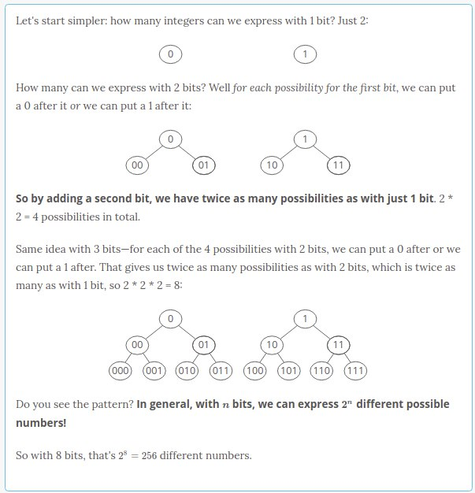

# Fixed-width integers

How many different numbers can we express with 1 byte (8 bits)?

2^8 =256 different numbers. How did we know to take 2^8?↴

~~~
What happens if we have the number 255 in an 8-bit unsigned integer (1111 1111 in binary) and we add 1? 
The answer (256) needs a 9th bit (1 0000 0000). But we only have 8 bits!

This is called an integer overflow. At best, we might just get an error. 
At worst, our computer might compute the correct answer but then just throw out the 9th bit, giving us zero (0000 0000) instead of 256 (1 0000 0000)! (Javascript automatically converts the result to Infinity if it gets too big.)
~~~

The 256 possibilities we get with 1 byte are pretty limiting. So **we usually use 4 or 8 bytes (32 or 64 bits) for storing integers.**

- 2-bit integers have 2^32 possible values—more than 4 billion
- 64-bit integers have 2^64 possible values—more than 10 billion billion (10^19).

~~~
"How come I've never had to think about how many bits my integers are?" Maybe you have but just didn't know it.

Have you ever noticed how in some languages (like Java and C) sometimes numbers are Integers and sometimes they're Longs? The difference is the number of bits (in Java, Integers are 32 bits and Longs are 64).

Ever created a table in SQL? When you specify that a column will hold integers, you have to specify how many bytes: 1 byte (tinyint), 2 bytes (smallint), 4 bytes (int), or 8 bytes (bigint).
~~~

Most integers are **fixed-width** or **fixed-length**, which means the number of bits they take up doesn't change.

It's usually safe to assume an integer is fixed-width unless you're told otherwise. Variable-size numbers exist, but they're only used in special cases.

If we have a 64-bit fixed-length integer, it doesn't matter if that integer is 0 or 193,457—it still takes up the same amount of space in RAM: 64 bits.

~~~
Are you familiar with big O notation? It's a tool we use for talking about how much time an algorithm takes to run or how much space a data structure takes up in RAM. It's pretty simple:

O(1) or constant means the time or space stays about the same even as the dataset gets bigger and bigger.

O(n) or linear means the time or space grows proportionally as the dataset grows.

So O(1) space is much smaller than O(n) space. And O(1) time is much faster than O(n) time.
~~~

In big O notation, we say **fixed-width integers take up constant space** or O(1) space.

And because they have a constant number of bits, **most simple operations on fixed-width integers (addition, subtraction, multiplication, division) take constant time (O(1) time).**

So fixed-width integers are very space efficient and time efficient.

But that efficiency comes at a cost—their values are limited. Specifically, they're limited to 2^n possibilities, where nn is the number of bits.

So there's a tradeoff. As we'll see, that's a trend in data structures—to get a nice property, we'll often have to lose something.