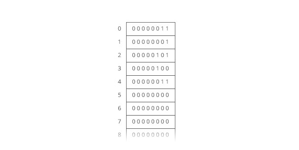
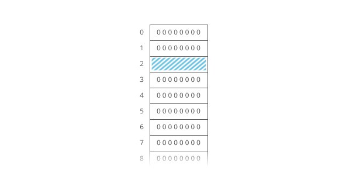
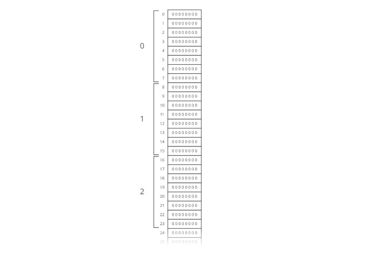
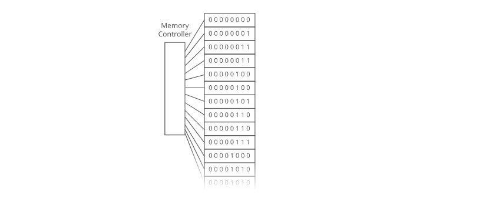

# Arrays

Ok, so we know how to store individual numbers. Let's talk about storing several numbers.

That's right, things are starting to heat up.

Suppose we wanted to keep a count of how many bottles of kombucha we drink every day.

Let's store each day's kombucha count in an 8-bit, fixed-width, unsigned integer. That should be plenty—we're not likely to get through more than 256 (2^8) bottles in a single day, right?

And let's store the kombucha counts right next to each other in RAM, starting at memory address 0:

Bam. That's an **array**. RAM is basically an array already.

Just like with RAM, the elements of an array are numbered. We call that number the **index** of the array element (plural: indices). In this example, each array element's index is the same as its address in RAM.

But that's not usually true. Suppose another program like Spotify had already stored some information at memory address 2:

We'd have to start our array below it, for example at memory address 3. So index 0 in our array would be at memory address 3, and index 1 would be at memory address 4, etc.:

Suppose we wanted to get the kombucha count at index 4 in our array. How do we figure out what address in memory to go to? Simple math:

Take the array's starting address (3), add the index we're looking for (4), and that's the address of the item we're looking for. 3 + 4 = 7. In general, for getting the nnth item in our array:

~~~

address of nth item in array = 
address of array start + n

~~~

This works out nicely because the size of the addressed memory slots and the size of each kombucha count are both 1 byte. So a slot in our array corresponds to a slot in RAM.

But that's not always the case. In fact, it's usually not the case. We usually use 64-bit integers.

So how do we build an array of 64-bit (8 byte) integers on top of our 8-bit (1 byte) memory slots?

We simply give each array index 8 address slots instead of 1:

So we can still use simple math to grab the start of the nth item in our array—just gotta throw in some multiplication:

~~~

address of nth item in array = 
address of array start + (n ∗ size of each item in bytes)

~~~

Don't worry—adding this multiplication doesn't really slow us down. Remember: addition, subtraction, multiplication, and division of fixed-width integers takes O(1) time. So all the math we're using here to get the address of the nnth item in the array takes O(1) time.

And remember how we said the memory controller has a direct connection to each slot in RAM? That means we can read the stuff at any given memory address in O(1) time.

**Together, this means looking up the contents of a given array index is O(1) time.** This fast lookup capability is the most important property of arrays.

But the formula we used to get the address of the nnth item in our array only works if:

- 1 **Each item in the array is the same size** (takes up the same number of bytes).
- 2 **The array is uninterrupted (contiguous) in memory**. There can't be any gaps in the array...like to "skip over" a memory slot Spotify was already using.

These things make our formula for finding the nth item work because they make our array predictable. We can predict exactly where in memory the nth element of our array will be.

But they also constrain what kinds of things we can put in an array. Every item has to be the same size. And if our array is going to store a lot of stuff, we'll need a bunch of uninterrupted free space in RAM. Which gets hard when most of our RAM is already occupied by other programs (like Spotify).

That's the tradeoff. Arrays have fast lookups (O(1)time), but each item in the array needs to be the same size, and you need a big block of uninterrupted free memory to store the array.