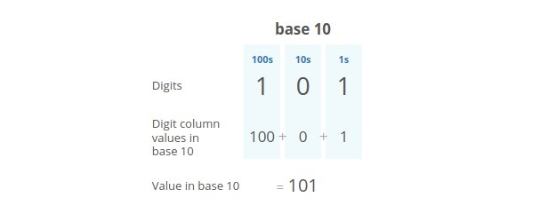
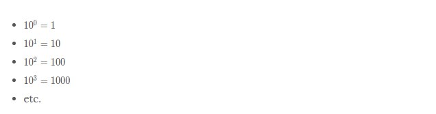
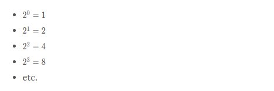
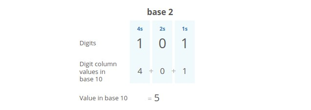
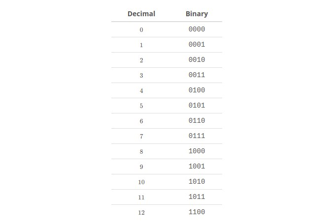

# Binary numbers

Let's put those bits to use. Let's store some stuff. Starting with numbers.

The number system we usually use (the one you probably learned in elementary school) is called **base 10**, because each digit has ten possible values (1, 2, 3, 4, 5, 6, 7, 8, 9, and 0).

But computers don't have digits with ten possible values. They have bits with two possible values. So they use **base 2** numbers.

Base 10 is also called **decimal**. Base 2 is also called **binary**.

To understand binary, let's take a closer look at how decimal numbers work. Take the number "101" in decimal:

~~~
1 0 1
~~~

Notice we have two "1"s here, but they don't mean the same thing. The leftmost "1" means 100, and the rightmost "1" means 1. That's because the leftmost "1" is in the hundreds place, while the rightmost "1" is in the ones place. And the "0" between them is in the tens place.

**So this "101" in base 10 is telling us we have "1 hundred, 0 tens, and 1 one."**

Notice how the places in base 10 (ones place, tens place, hundreds place, etc.) are sequential powers of 10:

The places in binary (base 2) are sequential powers of 2:

So let's take that same "101" but this time let's read it as a binary number:

Reading this from right to left: we have a 1 in the ones place, a 0 in the twos place, and a 1 in the fours place. So our total is 4 + 0 + 1 which is 5.

Here's how we'd count up to 12 in binary:

So far we've been talking about **unsigned integers** ("unsigned" means non-negative, and "integer" means a whole number, not a fraction or decimal). Storing other numbers isn't hard though. Here's how some other numbers could be stored:

**Fractions**: Store two numbers: the numerator and the denominator.

**Decimals**: Also two numbers: 1) the number with the decimal point taken out, and 2) the position where the decimal point goes (how many digits over from the leftmost digit).

**Negative Numbers**: Reserve the leftmost bit for expressing the sign of the number. 0 for positive and 1 for negative.

In reality we usually do something slightly fancier for each of these. But these approaches work, and they show how we can express some complex stuff with just 1s and 0s.

~~~
We've talked about base 10 and base 2...you may have also seen base 16, also called hexadecimal or hex.

In hex, our possible values for each digit are 0, 1, 2, 3, 4, 5, 6, 7, 8, 9, a, b, c, d, e, and f. 
Hex numbers are often prefixed with "0x" or "#".

In CSS, colors are sometimes expressed in hex. Interview Cake's signature blue color is "#5bc0de".
~~~