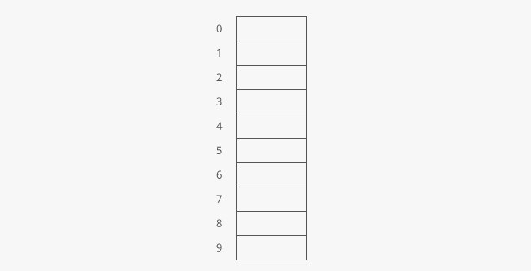
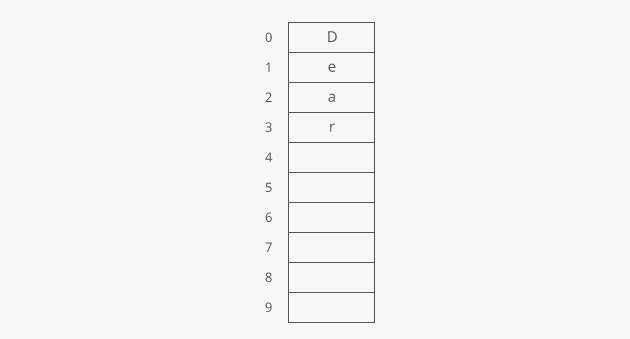
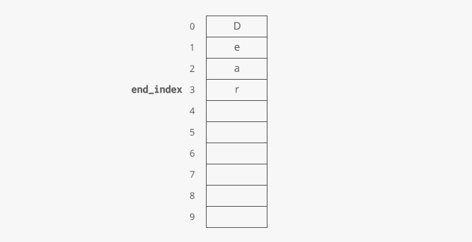
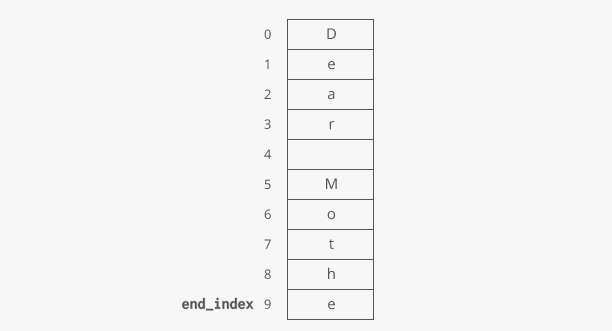
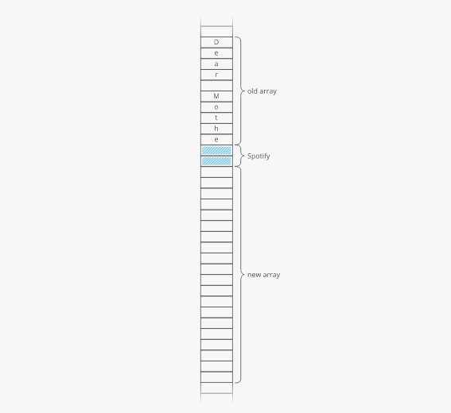
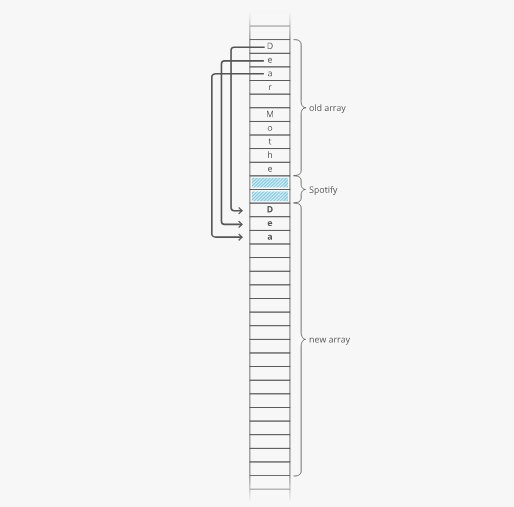
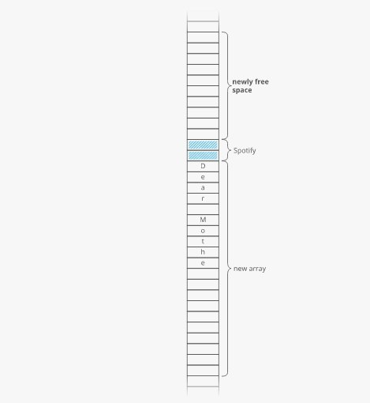

# Dynamic arrays

Let's build a very simple word processor. What data structure should we use to store the text as our user writes it?

Strings are stored as arrays, right? So we should use an array?

Here's where that gets **tricky: when we allocate an array in a low-level language like C or Java, we have to specify upfront how many indices we want our array to have.**

There's a reason for this—the computer has to reserve space in memory for the array and commit to not letting anything else use that space. We can't have some other program overwriting the elements in our array!

The computer can't reserve all its memory for a single array. So we have to tell it how much to reserve.

But for our word processor, we don't know ahead of time how long the user's document is going to be! So what can we do?

Just make an array and program it to resize itself when it runs out of space! This is called a **dynamic array**, and it's built on top of a normal array.

~~~
Python, Ruby, and JavaScript use dynamic arrays for their default array-like data structures. In Javascript, they're called "arrays." Other languages have both. For example, in Java, array is a static array (whose size we have to define ahead of time) and ArrayList is a dynamic array.
~~~

Here's how it works:

When you allocate a dynamic array, your dynamic array implementation makes an underlying static array. The starting size depends on the implementation—let's say our implementation uses 10 indices:

Say you append 4 items to your dynamic array:

At this point, our dynamic array contains 4 items. It has a length of 4. But the underlying array has a length of 10.

We'd say this dynamic array's **size** is 4 and its **capacity** is 10.

The dynamic array stores an end_index to keep track of where the dynamic array ends and the extra capacity begins.

If you keep appending, at some point you'll use up the full capacity of the underlying array:

Next time you append, the dynamic array implementation will do a few things under the hood to make it work:

**1. Make a new, bigger array**. Usually twice as big.

Why not just extend the existing array? Because that memory might already be taken. Say we have Spotify open and it's using a handful of memory addresses right after the end of our old array. We'll have to skip that memory and reserve the next 20 uninterrupted memory slots for our new array:

**2. Copy each element from the old array into the new array.**

**3. Free up the old array**. This tells the operating system, "you can use this memory for something else now."

**4. Append your new item.**

We could call these special appends "doubling" appends since they require us to make a new array that's (usually) double the size of the old one.

Appending an item to an array is usually an O(1) time operation, but a **single doubling append is an O(n) time operation since we have to copy all nn items from our array.**

Does that mean an append operation on a dynamic array is always worst-case O(n)time? Yes. So if we make an empty dynamic array and append nn items, that has some crazy time cost like O(n^2) or O(n!)?!?! Not quite.

Given this, in industry we usually wave our hands and say dynamic arrays have a time cost of O(1) for appends, even though strictly speaking that's only true for the average case or the amortized cost.

In an interview, if we were worried about that O(n)-time worst-case cost of appends, we might try to use a normal, non-dynamic array.

**The advantage of dynamic arrays over arrays is that you don't have to specify the size ahead of time, but the disadvantage is that some appends can be expensive.** That's the tradeoff.

But what if we wanted the best of both worlds...