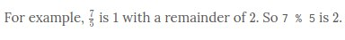
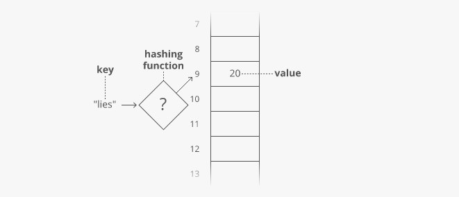

# Hash tables

Quick lookups are often really important. For that reason, we tend to use arrays (O(1)-time lookups) much more often than linked lists (O(i)-time lookups).

For example, suppose we wanted to count how many times each ASCII character appears in [Romeo and Juliet](https://raw.githubusercontent.com/GITenberg/The-Tragedy-of-Romeo-and-Juliet_1112/master/1112.txt). How would we store those counts?

We can use arrays in a clever way here. Remember—characters are just numbers. In ASCII (a common character encoding) 'A' is 65, 'B' is 66, etc.

So we can use the character('s number value) as the index in our array, and store the count for that character at that index in the array:


With this array, we can look up (and edit) the count for any character in constant time. Because we can access any index in our array in constant time.

Something interesting is happening here—this array isn't just a list of values. This array is storing two things: characters and counts. The characters are implied by the indices.

**So we can think of an array as a table with two columns...except you don't really get to pick the values in one column (the indices)—they're always 0, 1, 2, 3, etc.**

But what if we wanted to put any value in that column and still get quick lookups?

Suppose we wanted to count the number of times each word appears in Romeo and Juliet. Can we adapt our array?

Translating a character into an array index was easy. But we'll have to do something more clever to translate a word (a string) into an array index...


Here's one way we could do it:

Grab the number value for each character and add those up.


The result is 429. But what if we only have 30 slots in our array? We'll use a common trick for forcing a number into a specific range: the modulus operator (%). ↴

The **modulus** operation (also called **modulo** or **mod**) finds the remainder after dividing one integer by another. It's usually written as %.

For example, \frac{7}{5} is 11 with a remainder of 22. So 7 % 5 is 22.

It's commonly used to force a number into a certain range. For example, any number, when modded by 33 gives us an integer in the range 0..20..2:



It's commonly used to force a number into a certain range. For example, any number, when modded by 33 gives us an integer in the range 0..20..2:

```js

❯ 0 % 3
❮ 0
❯ 1 % 3
❮ 1
❯ 2 % 3
❮ 2
❯ 3 % 3
❮ 0
❯ 4 % 3
❮ 1
❯ 5 % 3
❮ 2
❯ 6 % 3
❮ 0
❯ 7 % 3
❮ 1

```

Modding our sum by 30 ensures we get a whole number that's less than 30 (and at least 0):

429%30=9

Bam. That'll get us from a word (or any string) to an array index.

This data structure is called a **hash table** or **hash map**. In our hash table, the counts are the **values** and the words ("lies," etc.) are the **keys** (analogous to the indices in an array). The process we used to translate a key into an array index is called a **hashing function**.



~~~
The hashing functions used in modern systems get pretty complicated—the one we used here is a simplified example.
~~~

~~~
Note that our quick lookups are only in one direction—we can quickly get the value for a given key, but the only way to get the key for a given value is to walk through all the values and keys.

Same thing with arrays—we can quickly look up the value at a given index, but the only way to figure out the index for a given value is to walk through the whole array.
~~~

One problem—what if two keys hash to the same index in our array? Look at "lies" and "foes":


They both sum up to 429! So of course they'll have the same answer when we mod by 30:

429%30=9

So our hashing function gives us the same answer for "lies" and "foes." This is called a **hash collision**. There are a few different strategies for dealing with them.

Here's a common one: instead of storing the actual values in our array, let's have each array slot hold a pointer to a linked list holding the counts for all the words that hash to that index:


One problem—how do we know which count is for "lies" and which is for "foes"? To fix this, we'll store the word as well as the count in each linked list node:


"But wait!" you may be thinking, "Now lookups in our hash table take O(n) time in the worst case, since we have to walk down a linked list." That's true! You could even say that in the worst case every key creates a hash collision, so our whole hash table degrades to a linked list.

In industry though, we usually wave our hands and say **collisions are rare enough that on average lookups in a hash table are O(1) time**. And there are fancy algorithms that keep the number of collisions low and keep the lengths of our linked lists nice and short.

But that's sort of the tradeoff with hash tables. You get fast lookups by key...except some lookups could be slow. And of course, you only get those fast lookups in one direction—looking up the key for a given value still takes O(n) time.