# Linked lists


Our word processor is definitely going to need fast appends—appending to the document is like the main thing you do with a word processor.

Can we build a data structure that can store a string, has fast appends, and doesn't require you to say how long the string will be ahead of time?

Let's focus first on not having to know the length of our string ahead of time. Remember how we used pointers to get around length issues with our array of baby names?

What if we pushed that idea even further?


What if each character in our string were a two-index array with:

- 1 the character itself
- 2 a pointer to the next character

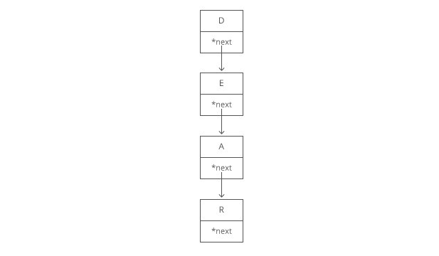

We would call each of these two-item arrays a **node** and we'd call this series of nodes a **linked list.**

Here's how we'd actually implement it in memory:

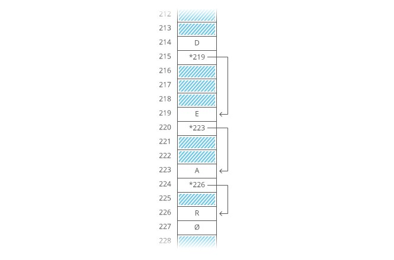

Notice how we're free to store our nodes wherever we can find two open slots in memory. They don't have to be next to each other. They don't even have to be in order:

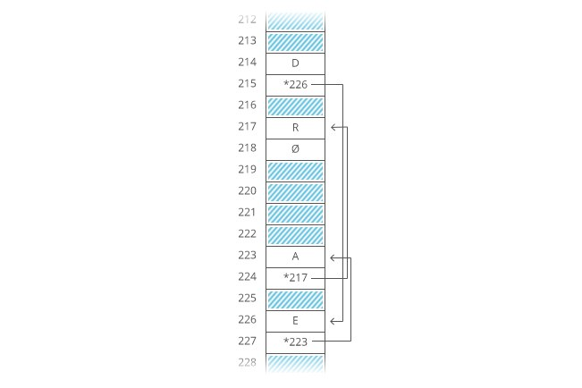

~~~
"But that's not cache-friendly," you may be thinking. Good point! We'll get to that.
~~~

The first node of a linked list is called the head, and the last node is usually called the tail.

~~~
Confusingly, some people prefer to use "tail" to refer to everything after the head of a linked list. In an interview it's fine to use either definition. Briefly say which definition you're using, just to be clear.
~~~

It's important to have a pointer variable referencing the head of the list—otherwise we'd be unable to find our way back to the start of the list!

We'll also sometimes keep a pointer to the tail. That comes in handy when we want to add something new to the end of the linked list. In fact, let's try that out:

Suppose we had the string "LOG" stored in a linked list:

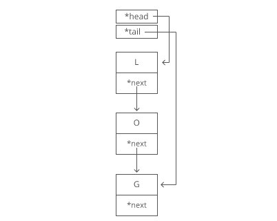

Suppose we wanted to add an "S" to the end, to make it "LOGS". How would we do that?

Easy. We just put it in a new node:

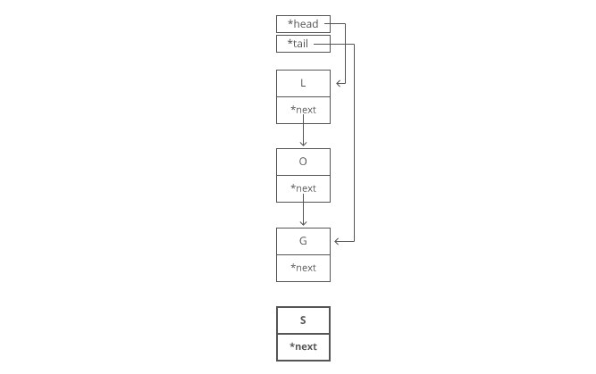

And tweak some pointers:

1. Grab the last letter, which is "G". Our tail pointer lets us do this in O(1) time.

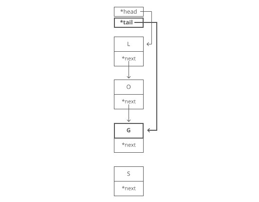

2. Point the last letter's next to the letter we're appending ("S").

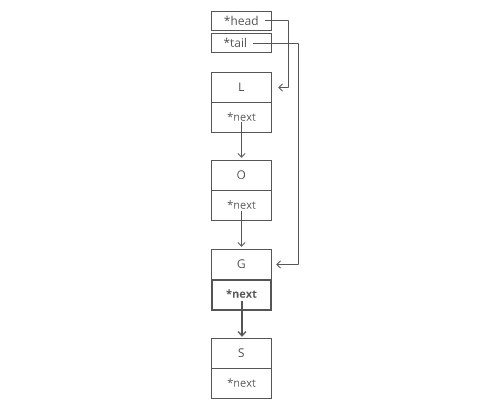

3. Update the tail pointer to point to our new last letter, "S".

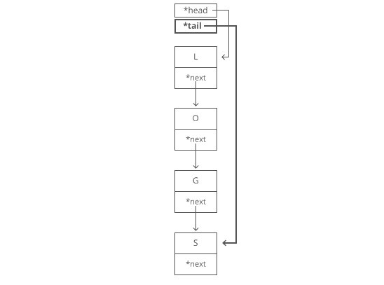

That's O(1) time.

~~~
Why is it O(1) time? Because the runtime doesn't get bigger if the string gets bigger. No matter how many characters are in our string, we still just have to tweak a couple pointers for any append.
~~~

Now, what if instead of a linked list, our string had been a dynamic array? We might not have any room at the end, forcing us to do one of those doubling operations to make space:

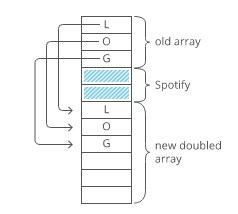

So with a dynamic array, our append would have a worst-case time cost of O(n).

Linked lists have worst-case O(1)O(1)-time appends, which is better than the worst-case O(n)time of dynamic arrays.

~~~
That worst-case part is important. The average case runtime for appends to linked lists and dynamic arrays is the same: O(1)O(1).
~~~

Now, what if we wanted to prepend something to our string? Let's say we wanted to put a "B" at the beginning.

For our linked list, it's just as easy as appending. Create the node:

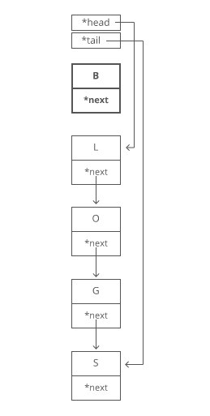

And tweak some pointers:

1. Point "B"'s next to "L".
2. Point the head to "B".

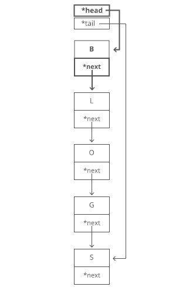

Bam. O(1) time again.

But if our string were a dynamic array...

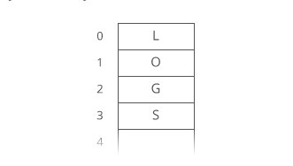

And we wanted to add in that "B":

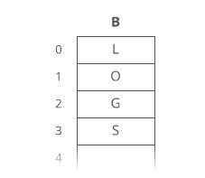

We have to move each character one 

Now we can drop the "B" in there:

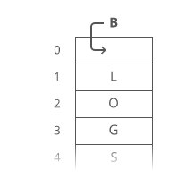

What's our time cost here?

It's all in the step where we made room for the first letter. We had to move all n characters in our string. One at a time. That's O(n) time.

**So linked lists have faster prepends (O(1) time) than dynamic arrays (O(n) time).**

~~~
No "worst case" caveat this time—prepends for dynamic arrays are always O(n) time. And prepends for linked lists are always O(1) time.
~~~

These quick appends and prepends for linked lists come from the fact that linked list nodes can go anywhere in memory. They don't have to sit right next to each other the way items in an array do.

So if linked lists are so great, why do we usually store strings in an array? **Because arrays have O(1)-time lookups.** And those constant-time lookups come from the fact that all the array elements are lined up next to each other in memory.

Lookups with a linked list are more of a process, because we have no way of knowing where the ith node is in memory. So we have to walk through the linked list node by node, counting as we go, until we hit the i th item.

```js
  
  function getIthItemInLinkedList(head, i) {

    if (i < 0) {
        throw new Error("i can't be negative: " + i);
    }

    var currentPosition = 0;
    var currentNode = head;

    while (currentNode) {

        if (currentPosition === i) {
            // found it!
            return currentNode;
        }

        // move on to the next node
        currentNode = currentNode.next;
        currentPosition++;
    }

    throw new Error("List has fewer than i + 1 (" + (i + 1) + ") nodes");
}
```

That's i + 1 steps down our linked list to get to the iith node (we made our function zero-based to match indices in arrays).**So linked lists have O(i)-time lookups.** Much slower than the O(1)-time lookups for arrays and dynamic arrays.

Not only that **walking down a linked list is not cache-friendly**. Because the next node could be anywhere in memory, we don't get any benefit from the processor cache. This means lookups in a linked list are even slower.

So the tradeoff with linked lists is they have faster prepends and faster appends than dynamic arrays, but they have slower lookups.