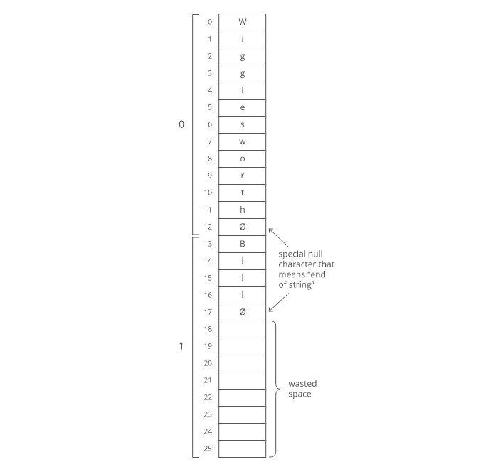
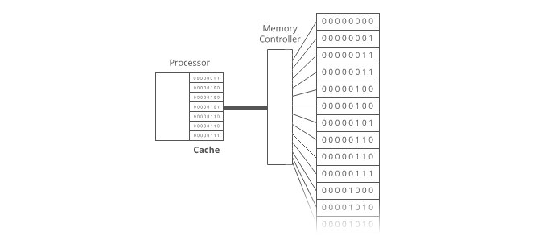

# Pointers

Remember how we said every item in an array had to be the same size? Let's dig into that a little more.

Suppose we wanted to store a bunch of ideas for baby names. Because we've got some really cute ones.

Each name is a string. Which is really an array. And now we want to store those arrays in an array. Whoa.

Now, what if our baby names have different lengths? That'd violate our rule that all the items in an array need to be the same size!

We could put our baby names in arbitrarily large arrays (say, 13 characters each), and just use a special character to mark the end of the string within each array...

~~~
"Wigglesworth" is a cute baby name, right?
~~~

But look at all that wasted space after "Bill". And what if we wanted to store a string that was more than 13 characters? We'd be out of luck.

There's a better way. Instead of storing the strings right inside our array, let's just put the strings wherever we can fit them in memory. Then we'll have each element in our array hold the address in memory of its corresponding string. Each address is an integer, so really our outer array is just an array of integers. We can call each of these integers a **pointer**, since it points to another spot in memory.

~~~
The pointers are marked with a * at the beginning.
~~~

Pretty clever, right? This fixes both the disadvantages of arrays:

- 1 The items don't have to be the same length—each string can be as long or as short as we want.
- 2 We don't need enough uninterrupted free memory to store all our strings next to each other—we can place each of them separately, wherever there's space in RAM.

We fixed it! No more tradeoffs. Right?

Nope. Now we have a new tradeoff:

Remember how the memory controller sends the contents of nearby memory addresses to the processor with each read? And the processor caches them? So reading sequential addresses in RAM is faster because we can get most of those reads right from the cache?

Our original array was very **cache-friendly**, because everything was sequential. So reading from the 0th index, then the 1st index, then the 2nd, etc. got an extra speedup from the processor cache.

**But the pointers in this array make it not cache-friendly**, because the baby names are scattered randomly around RAM. So reading from the 0th index, then the 1st index, etc. doesn't get that extra speedup from the cache.

That's the tradeoff. This pointer-based array requires less uninterrupted memory and can accommodate elements that aren't all the same size, but it's slower because it's not cache-friendly.

~~~
This slowdown isn't reflected in the big O time cost. Lookups in this pointer-based array are still O(1)time.
~~~