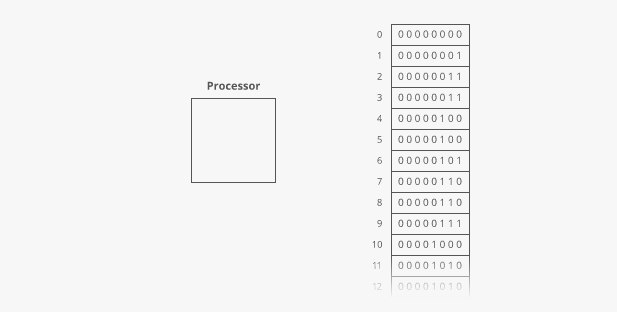
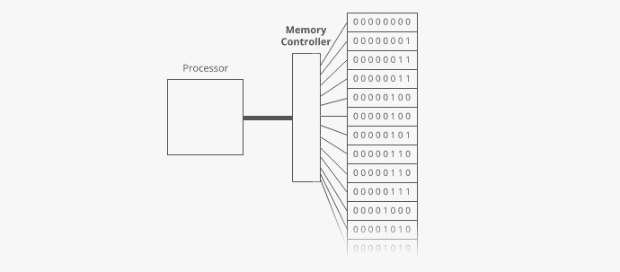
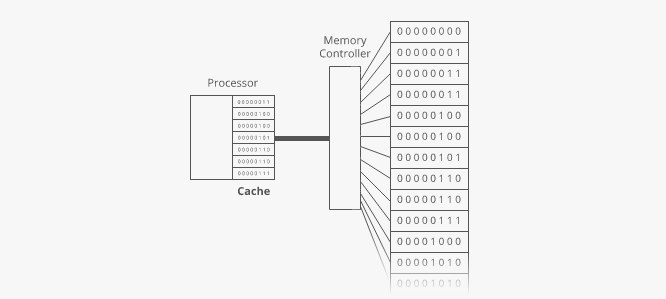

# Random Access Memory (RAM)

## When a computer is running code, it needs to keep track of variables (numbers, strings, arrays, etc.).

Variables are stored in random access memory (RAM). We sometimes call RAM "working memory" or just "memory."

~~~
RAM is not where mp3s and apps get stored. In addition to "memory," your computer has storage (sometimes called "persistent storage" or "disk"). While memory is where we keep the  variables our functions 
allocate as they crunch data for us,  storage is where we keep files like mp3s, videos, Word documents
and even executable programs or apps.

Memory (or RAM) is faster but has less space, while storage (or "disk") is slower but has more space. 
A modern laptop might have ~500GB of storage but only ~16GB of RAM.
~~~

Think of RAM like a really tall bookcase with a lot of shelves. Like, billions of shelves.

~~~
It just keeps going down. Again, picture billions of these shelves.
~~~

The shelves are numbered.

We call a shelf's number its **address**.

Each shelf holds 8 **bits**. A bit is a tiny electrical switch that can be turned "on" or "off." But instead of calling it "on" or "off" we call it 1 or 0.

8 bits is called a **byte**. So each shelf has one byte (8 bits) of storage.

Of course, we also have a processor that does all the real work inside our computer:

It's connected to a **memory controller**. The memory controller does the actual reading and writing to and from RAM. It has a direct connection to each shelf of RAM.

That direct connection is important. It means we can access address 0 and then immediately access address 918,873 without having to "climb down" our massive bookshelf of RAM.

That's why we call it Random Access Memory (RAM)—we can Access the bits at any Random address in Memory right away.

~~~
Spinning hard drives don't have this "random access" superpower, because there's no direct connection to each byte on the disk. Instead, there's a reader—called a head—that moves along the surface of a spinning storage disk (like the needle on a record player). Reading bytes that are far apart takes longer because you have to wait for the head to physically move along the disk.
~~~

Even though the memory controller can jump between far-apart memory addresses quickly, programs tend to access memory that's nearby. **So computers are tuned to get an extra speed boost when reading memory addresses that're close to each other**. Here's how it works:

The processor has a **cache** where it stores a copy of stuff it's recently read from RAM.

~~~
Actually, it has a series of caches. But we can picture them all lumped together as one cache like this.
~~~

This cache is much faster to read from than RAM, so the processor saves time whenever it can read something from cache instead of going out to RAM.

**When the processor asks for the contents of a given memory address, the memory controller also sends the contents of a handful of nearby memory addresses.** And the processor puts all of it in the cache.

So if the processor asks for the contents of address 951, then 952, then 953, then 954...it'll go out to RAM once for that first read, and the subsequent reads will come straight from the super-fast cache.

But if the processor asks to read address 951, then address 362, then address 419...then the cache won't help, and it'll have to go all the way out to RAM for each read.

So reading from sequential memory addresses is faster than jumping around.