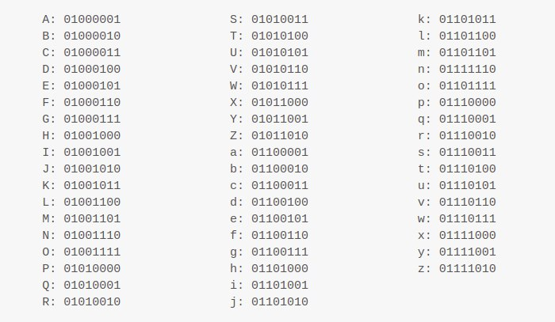
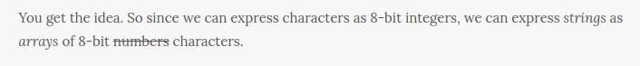

# Strings

Okay, let's store some words. 

A series of characters (letters, punctuation, etc.) is called a **string**.

We already know one way to store a series of things—arrays. But how can an array store characters instead of numbers?

Easy. Let's define a mapping between numbers and characters. Let's say "A" is 1 (or 0000 0001 in binary), "B" is 2 (or 0000 0010 in binary), etc. Bam. Now we have characters.

This mapping of numbers to characters is called a **character encoding**. One common character encoding is "ASCII". Here's how the alphabet is encoded in ASCII:

You get the idea. So since we can express characters as 8-bit integers, we can express strings as arrays of 8-bit characters.

